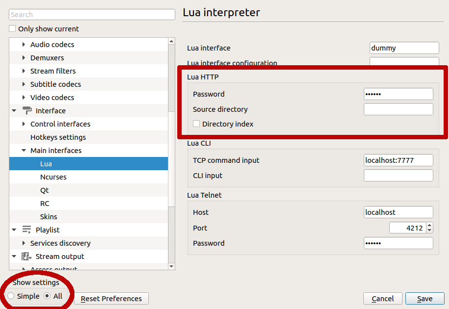

# VLC Media Player  
VLC is a free and open source cross-platform multimedia player and framework that plays most multimedia files as well as DVDs, Audio CDs, VCDs, and various streaming protocols.

You can find it here: <a href="https://www.videolan.org/vlc/index.html" title="VLC">videolan.org</a>

# *IMPORTANT UPDATE!*
**If you used this module prior to the feedback and variables version, the Play ID has changed!**
The prior versions *sometimes* worked by starting the playlist at number 3. This version retrieves the
current playlist from VLC and numbers from 1 at the top.The first item in the list is *always* number 1 which means if you click the heading and sort the list, number 1 is *still* the first one on the list.

VLC does not generate an error if you enter a Play ID that is not in the playlist. It will play the active item as if the Play ID was not there.

Due to the nature of the feedback and play list syncronization, the module status shows ERROR if VLC is not running yet. This is normal. It is to let you know that buttons may not work as expected. The status will automatically change to OK when you start VLC.

## Configuration
If you can successfully connect to VLC with a browser, this module will work. Enter the same information from the URL.

Setting | Description
-----------------|---------------
**Target IP** | Enter the address of the VLC computer. You can enter 127.0.0.1 if Companion is running on the same computer.
**Target Port** | Enter the port VLC is listening for HTTP/REST commands. Default port for VLC is 8080.
**Password** | Enter the password if required to interact with VLC
**Increase timer resolution** | Enable for better response and countdown timer accuracy. Disable if companion or playback is bogged down.
**Number of clip names to reserve** | Enter how many slots to reserve for clip names. Maximum is 50 [1]
**Display · for empty clips?** | Enable to replace empty clip name with · (bullet). Otherwise leave name blank.

[1]: Companion displays $NA when a dynamic variable is not set. The playback clip names for VLC are dynamic so if your playlist has 5 items, entering $(vlc:pname_6) will show $NA. By reserving a certain number of clip names, the module will add blank (or bullet) entries for those clips that are not in the VLC playlist. *Warning:* If you send VLC a command to Play an empty ID, it will ignore the ID and act like a simple Play command.

## Actions
Action | Description
-----------------|---------------
**Play** | Play the last active item
**Play ID** | Play a specific item from the playlist. If ID does not exist, this command acts like a simple **Play** command.
**Stop** | Stop playback
**Pause / Resume** | Toggle pause. If state is 'stopped' then play current item. If no current item then play the 1st item.
**Next** | Jump to next item
**Previous** | Jump to previous item
**Full Screen** | Toggle full screen
**Loop** | Toggle playlist looping mode (cancels repeat mode)
**Shuffle** | Toggle playlist shuffle (random) mode
**Repeat** | Toggle item repeat mode (cancels loop mode)

## Variables available
Variable | Description
-----------------|---------------
**$(INSTANCENAME:r_stat)** | Playback Status Character: "⏵" if running, "⏸" if paused, "⏹" if stopped
**$(INSTANCENAME:r_id)** | VLC ID of the Playing Item
**$(INSTANCENAME:r_name)** | Name of the Playing Item
**$(INSTANCENAME:r_num)** | Playlist Number of the Playing Item
**$(INSTANCENAME:r_left)** | Time left for Playing Item, variable size
**$(INSTANCENAME:r_hhmmss)** | Remaining time for Playing Item as "HH:MM:SS"
**$(INSTANCENAME:r_hh)** | Hours left for Playing Item
**$(INSTANCENAME:r_mm)** | Minutes left for Playing Item
**$(INSTANCENAME:r_ss)** | Seconds left for Playing Item
**$(INSTANCENAME:e_time)** | Elapsed time for Playing Item, variable size
**$(INSTANCENAME:e_hhmmss)** | Elapsed time for Playing Item as "HH:MM:SS"
**$(INSTANCENAME:e_hh)** | Elapsed time Hours for Playing Item
**$(INSTANCENAME:e_mm)** | Elapsed time Minutes for Playing Item
**$(INSTANCENAME:e_ss)** | Elapsed time Seconds for Playing Item
**$(INSTANCENAME:pname_{num})** | Title of the Playlist Item {num}. Limited to 20 characters. If longer this will display the first 10 and the last 10 characters of the title.

To use these, replace INSTANCENAME with the label/name of your module instance.

## Feedback available
Feedback | Description
-----------------|---------------
**Color for Player State** | Change button colors for Player State (Stopped, Paused, Playing)
**Color for Loop Mode** | Change button colors when in Loop Playlist Mode
**Color for Repeat Mode** | Change button colors when in Repeat Item Mode
**Color for Shuffle Mode** | Change button colors when in shuffle (random) play Mode
**Color for Full Screen Mode** | Change button colors when player is Full Screen

## Configuring VLC
Open the Tools-->Preferences window.

On the Main Interfaces page, Check 'Web' option box, higlighted in red.

On the Main Interfaces-->Lua page, set the password for Companion access.

***Note:** VLC must be closed and restarted for the password to take effect.*
